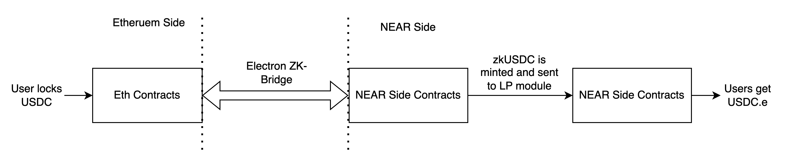

# Liquidity Module

A big problem with bridges is that they give you these wrapped assets that have little utility. This problem does not exist in our bridge, as we give the user native assets on both the sides. We achieve this via the use of liquidity pools that can convert wrapped assets to native assets and vice-versa.

Detailed design of our Liquidity module is given below.

### Video Explainer -&#x20;

### ETH -> NEAR



### NEAR -> ETH



^^ please see the videos before proceeding

#### Important Terms

**The LP Contract:** This is the contract in which all Liquidity Providers (LP’s) add liquidity (zkUSDC or USDC). All LP’s add liquidity into the same LP contract.

**LP token:** Whenever LP’s deposit liquidity in the contract, they get LP tokens that represent their share in the pool. So if an LP supplied 20% of the total liquidity in the bridge, they will be given new LP tokens such that they own 20% of the LP tokens. New LP tokens are minted everytime someone deposits liquidity into the pool, and LP tokens must be burned to withdraw liquidity from the pool.

**Let us now try to understand how much tokens an LP will get when they add liquidity to a pre-existing pool.**

<figure><figcaption></figcaption></figure>

### Adding Liquidity

Consider the scenario when a new LP is adding new stable-coins. LP adds new stable coins $$V_1$$and gets LP tokens in return as $$T_1$$

Just _before_ the LP adds the liquidity, the supply of stable coin supply is = $$TVL_1$$ and the total LP coin supply is $$S_1$$

Just _after_ the LP adds the liquidity, the supply of stable coin supply is = $$TVL_2$$ and the total LP coin supply is $$S_2$$

Hence we can write ⇒

$$S_2 = S_1 + T_1$$

$$TVL_2 = TVL_1 + V_1$$

Furthermore, the % stakeholding in the LP token of the LP should be the same as the fraction of liquidity that belongs to him.

Hence, we can write ⇒

