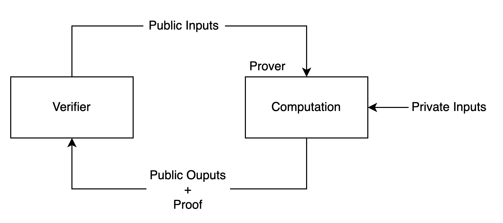

# Intro to Zero-Knowledge Proofs for Developers

Zero-Knowledge Proofs allow us to perform computations just like any other programming language, but they also provide the properties discussed below.

In zk, there are two entities - a "prover" and a "verifier" such that

1. Prover is someone who wants to “prove” that they have performed a valid computation on provided inputs
2. Verifier is the entity that provides the inputs and will verify the prover’s claim of having performed the said computation

<figure><figcaption><p>ZKP's as a black box</p></figcaption></figure>

Let us consider an example

Let us say the prover wants to prove that they know the pre-image of a hash without revealing the pre-image. Let's see how this would happen

1. Verifier provides the hash H to the prover
2. The prover creates a zk-proof that encapsulates the following logic
   * Take the hash H as a public input, and pre-image A as a private input. Public means that the value of H is visible to everyone, while private means that value of A is hidden
   * Calculate the h = hash(A)
   * Apply the condition - assert(H==h)
   * End Programme
3. Prover provides the Proof and the public inputs/outputs to the verifier.
4. Verifier takes this and runs the function - verify(Proof, H)
5. Now the verifier can be sure that the prover calculated the hash of some input, and that hash was equal to H.
6. ZKP provides the guarantee that all logic encapsulated inside the proof was performed as advertised

You can do this yourself using Zokrates - a programming language used to define the logic that we want to prove. This is a bit implied, the actual version is a bit more complicated.

All values inside Zokrates or ZK system for that matter can be a max of 254 bits. All numbers bigger than this must use BigInt.

```python
import "hashes/sha256/512bitPacked" as sha256BigInt

def main(private BigInt A, public BigInt H):
    BigInt h = sha256BigInt(A)
    assert(h == H)
    return
```

Please note that the ZKP only hides the private inputs. The computation logic itself is public and can't be hidden.

Comment: Change this example to "Verifier asks the prover to change the salt used to calculate the hash, without revealing the pre-image. The verifier can even specify the salt they want to be used. "\


Comment: In this example, there should be some public output too, for better clarity. Add the salt requirement to achieve that.

You can check out this video as well. Now that we understand the ZK technology, let’s dive deeper into how the protocol works.


High Level ZKPs explanation

