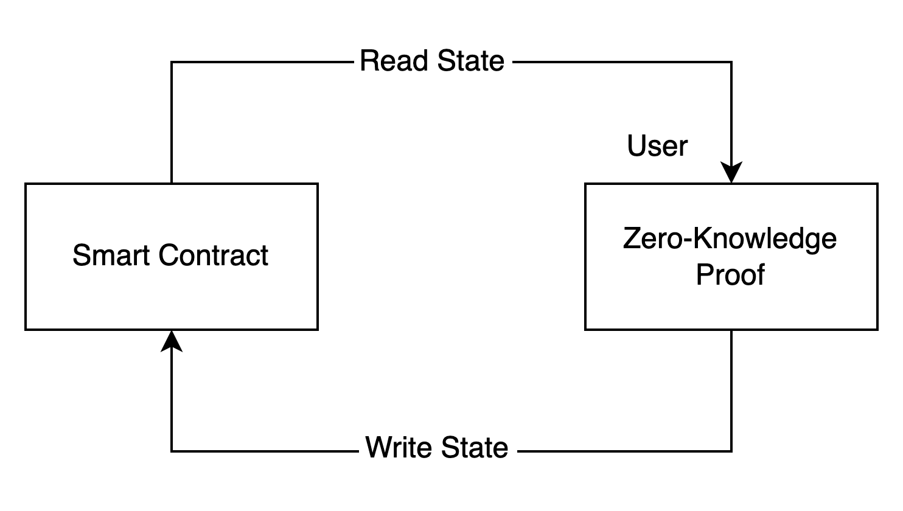
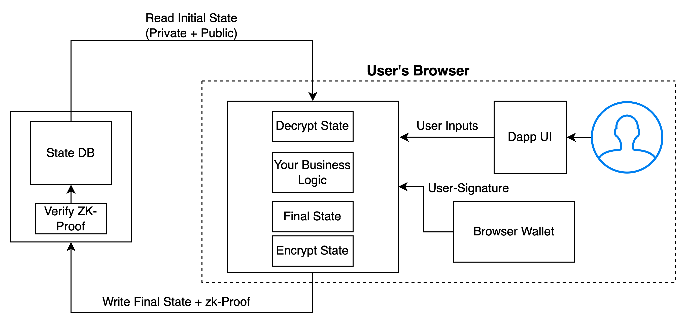

# Protocol Design

Since the state and transactions on-chain are completely public, to make them private we will -

1. Store the on-chain state in encrypted form. Only the “owner(s)” of the state will be able to decrypt the state. Owner will be defined by the public key/address.
2. Make transactions by creating zk-proofs of the state transitions we want to make. This will allow us to apply transactions to the on-chain state without having to reveal the contents of the state and the transaction
3.

    <figure><figcaption></figcaption></figure>

In our system, the smart contract will serve as the verifier, and the user side will act as the prover. The smart contact will store state variables as `encrypted` or `unencrypted`. Encrypted vars will be the one that manage the user-specfic data, and unencrypted var will store values that are of public interest, that need to be used by some other logic, etc.

Now, the basic flow for any application in our system is -

1. User reads the encrypted data from smart contract
2. User decrypts the state.
3. User provides some application-specific additional inputs such as pubkey, signature, etc
4. User performs some compaution to calculate new state. You can add any custom business logic here.
5. User encrypts the new state
6. USer creates a zk-proof
7. User provides the proof and the new encrypted state to the smart contract. The user can use a relayer for this, so that their address is not revealed on-chain.
8. Smart contracts checks the proof by taking in the encrypted initial state as an input
9. Upon successful verification, smart contract updates the previous state with new state.

Features -

No user data ever hits the chain in the decrypted form. This way, no user data is ever revealed to the public.

<figure><figcaption></figcaption></figure>

Let's look at a few examples to understand how to use Electron to build products.

Sections to be Added -\
Discuss in more detail the mental model we are introducing.\
To learn zkp online, most tutorials are either too trivial and un-related, or jump into too much cryptography straight away. The time it takes to start thinking about use cases (business logic) is 6 months. We want to reduce this to 1 afternoon.
