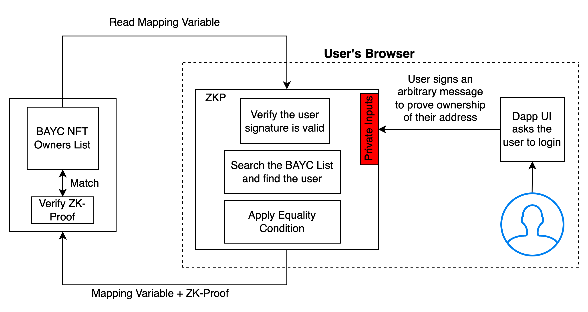

# Prove Membership of Bored Ape Yatch Club

In this section, we will discuss how you can build a Dapp where the users can prove that they own a BAYC NFT without revealing their wallet address or the BAYC NFT they own. Let's get started.

Let us say we are on Polygon.

Let's assume that there is some mapping variable on-chain that maintains the list of BAYC owners. This list is of the form - `"address" : "NFT ID"`

```json
{
   "0xADA5634VEREG4" : "NFTg3t4rd3rt43f3g3f",
   "0xADA5634VEREG4" : "NFTg3t4rd3rt43f3g3f",
   "0xADA5634VEREG4" : "NFTg3t4rd3rt43f3g3f",
   ...
}
```


Our goal is to prove that the user's address is within this mapping, without revealing it. Under the normal (non-private) setting, this would be easy to achieve as the user could just call a smart contract function that would check if `msg.sender` is within this mapping variable. Let us see how we can do this privately using Electron Protocol.

1. The user will construct a proof, where the user will supply their signature as a private input, and the mapping variables as a public input.
2. Inside the ZK-proof, we will first check the signature validity, and then check if the supplied signature's address is part of the BAYC list.
3. The user (in their browser) will construct this proof and supply it to the smart contract. {Proof, Public Inputs (BAYC List)}
4. The smart contract will first check the proof's validity -
5. For this it will need the public input/ouputs of the ZKP, and the Proof.
6. Next it must check if the BAYC list used to construct the proof is the same as the on-chain BAYC list.
7. Hence it will apply the equality check. If it passes, then we know that the user is indeed part of the club

<figure><figcaption></figcaption></figure>

Let's start building it now actually -

Defining the on-chain BAYC list

* Smart contract ID and how to refer to elements in the list

Defining the Proof generator

Fix needed -\
What prevents someone from taking my proof, and submitting it again themselves? Fix - add a nonce in the signature message, and track all the nonces every used on-chain. Nonce can be supplied as a public input to the zkp.
